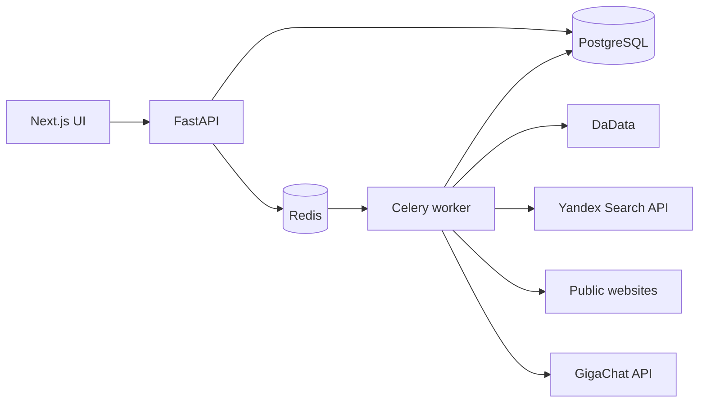
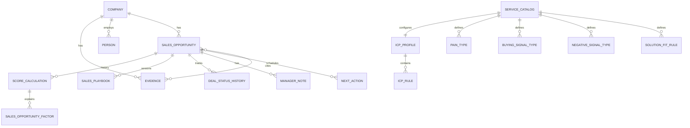

# Лидоскоп

Локальный evidence-first сервис для исследования российских B2B-компаний и подготовки сделки. Он получает организации из DaData, находит и проверяет официальные сайты через Yandex Search API, безопасно сканирует публичные страницы, извлекает подтверждаемые факты и использует GigaChat для структурированной классификации. Числовые Sales Intelligence оценки считаются только детерминированным rule engine.

Проект не содержит демо-компаний, зашитых лидов или production-моков. Без ключей внешних сервисов UI показывает честное состояние «не подключено», а исследование завершается диагностируемой ошибкой.

## Что реализовано

- создание и отслеживание фонового исследования через Celery/Redis;
- DaData и Yandex Search API как реальные коннекторы;
- проверка официального сайта по названию/ИНН, robots.txt, same-host redirects и SSRF-защита;
- карточки компаний, реквизиты, ресурсы, ЛПР, контакты, evidence и граф связей;
- отдельный, объяснимый Digital Presence Score;
- каталог собственных услуг и онбординг Sales-профиля: ICP, боли, buying/negative signals, Solution Fit и веса;
- ICP Fit, Pain Score, Purchase Probability, Solution Fit и общий Sales Opportunity Score;
- time-decay buying signals, hard exclusions, data completeness и evidence confidence;
- append-only история расчётов и версий весов;
- ранжированный список с фильтрами по баллам, услуге, статусу, городу, региону, ЛПР и свежести сигнала;
- Deal Intelligence Card, Sales Playbook, evidence-ссылки, статусы сделки, заметки и следующие действия;
- CSV/JSON/XLSX экспорт и диагностика интеграций.

## Архитектура



GigaChat планирует запросы, классифицирует evidence и формирует текст playbook. Он не имеет права выставлять числовые оценки. Rule engine считает их по сохранённой конфигурации и пишет immutable snapshot входа, весов, версии и факторов.



## Быстрый запуск

Нужны Docker Desktop и Docker Compose.

```powershell
Copy-Item .env.example .env
python -c "from cryptography.fernet import Fernet; print(Fernet.generate_key().decode())"
```

Вставьте результат в `LIDOSKOP_MASTER_KEY`, задайте стойкий `POSTGRES_PASSWORD`, затем:

```powershell
docker compose up --build
```

Откройте `http://127.0.0.1:3000`. В разделе «Настройки» сохраните Authorization Key GigaChat, Client ID, scope и модель; в «Источниках» — токены DaData и Yandex Search API. Секреты хранятся в БД только в зашифрованном виде и не возвращаются через API.

Порядок первого рабочего сценария:

1. Добавьте реальную услугу в «Мои услуги».
2. Откройте её Sales-профиль и задайте ICP, боли, сигналы и discovery-вопросы.
3. Подключите GigaChat, DaData и Yandex Search API.
4. Создайте исследование и дождитесь фоновой обработки.
5. Откройте «Возможности продаж» и Deal Intelligence Card.

Swagger доступен на `http://127.0.0.1:8000/docs`, healthcheck — `http://127.0.0.1:8000/api/v1/health`.

## Разработка без Docker

Backend требует Python 3.12+, PostgreSQL и Redis; frontend — Node.js 22+ и pnpm.

```powershell
python -m venv .venv
.\.venv\Scripts\pip install -e ".\backend[dev]"
cd frontend
corepack enable
pnpm install --frozen-lockfile
cd ..
```

Запустите `alembic upgrade head`, FastAPI, Celery worker и Next.js командами из `Makefile` либо эквивалентами для PowerShell.

## Проверки

```powershell
cd backend
ruff check app tests alembic
mypy app
pytest -q

cd ..\frontend
pnpm test
pnpm lint
pnpm typecheck
pnpm build
```

Unit-тесты используют только локальные fixtures для формул, схем, безопасности и адаптеров. Полный внешний E2E намеренно не подменяется mock-данными: для него нужны пользовательские ключи GigaChat/DaData/Yandex и работающие PostgreSQL/Redis.

## Формула Sales Opportunity

По умолчанию используется взвешенное геометрическое среднее:

`100 × (ICP/100)^0.30 × (Pain/100)^0.25 × (Intent/100)^0.25 × (Solution/100)^0.20`

Сумма весов обязана быть равна 1. Нулевая обязательная компонента обнуляет итог. Свежесть positive и negative signals уменьшается как `0.5^(age_days / decay_days)`. Отсутствие CRM, рекламы, аналитики или онлайн-записи само по себе остаётся `unknown`: это вопрос для discovery, а не доказанная боль.

## Безопасность и ограничения

- сервис рассчитан на локальный запуск на `127.0.0.1`; встроенной многопользовательской авторизации нет;
- crawler не обходит авторизацию, CAPTCHA и robots.txt, не сканирует приватные IP и не выполняет SMTP-проверки ящиков;
- персональные данные должны обрабатываться только на законном основании; предусмотрен срок хранения `DATA_RETENTION_DAYS`;
- тексты playbook являются подготовкой менеджера, а не подтверждением бюджета или намерения купить;
- перед публикацией в интернет добавьте reverse proxy, TLS, auth/RBAC, rate limits, secret manager и резервное копирование.

## Структура

- `backend/app` — API, ORM, коннекторы, crawler, scoring, orchestrator и worker;
- `backend/alembic` — миграции PostgreSQL;
- `backend/tests` — unit-тесты;
- `frontend/app` — Next.js App Router UI;
- `docker-compose.yml` — PostgreSQL, Redis, migration job, API, worker и frontend.

Репозиторий: [github.com/Sheng161/lidoskop](https://github.com/Sheng161/lidoskop).
